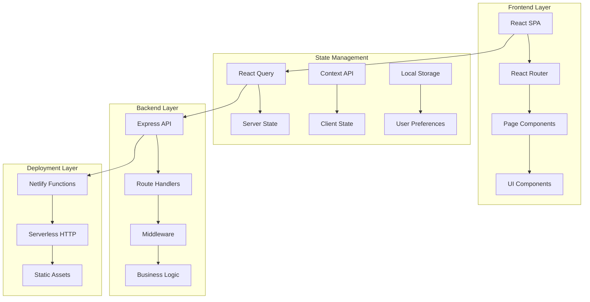

# 🌐 SynergySphere

<div align="center">

**Advanced Team Collaboration & Project Management Platform**

[](https://reactjs.org/)
[](https://www.typescriptlang.org/)
[](https://vitejs.dev/)
[](https://expressjs.com/)
[](https://tailwindcss.com/)
[](https://www.radix-ui.com/)

[](https://choosealicense.com/licenses/mit/)
[](https://www.netlify.com/)

*Modern full-stack React + Express boilerplate with TypeScript, Vite, and a rich UI component library. Single-port development server, shared TypeScript types, and batteries-included developer experience.*

</div>

## 📋 Table of Contents

- [🚀 Overview](#-overview)
- [✨ Key Features](#-key-features)
- [🛠️ Tech Stack](#️-tech-stack)
- [🏗️ Architecture](#️-architecture)
- [📁 Project Structure](#-project-structure)
- [⚙️ Installation & Setup](#️-installation--setup)
- [🎨 UI Components](#-ui-components)
- [🔧 Development Workflow](#-development-workflow)
- [🚀 Deployment](#-deployment)
- [🧪 Testing](#-testing)
- [📚 API Reference](#-api-reference)
- [🤝 Contributing](#-contributing)
- [📝 License](#-license)

---

## 🚀 Overview

**SynergySphere** is a comprehensive team collaboration platform designed to streamline project management, task tracking, and team communication. Built with modern web technologies, it provides a seamless experience for teams to work together efficiently.

### 🎯 Business Problem Solved

- **🔄 Fragmented Tools**: Consolidates project management, task tracking, and team communication in one platform
- **📱 Poor Mobile Experience**: Responsive design ensures productivity on any device
- **🤝 Communication Gaps**: Context-aware discussions keep conversations organized
- **📊 Limited Visibility**: Real-time dashboards provide insights into team performance

### 🏆 Core Value Proposition

1. **🚀 Fast Development**: Single-port dev server with hot reload for both frontend and backend
2. **🎨 Beautiful UI**: Rich component library with Radix UI primitives and TailwindCSS
3. **🔧 Type Safety**: Shared TypeScript types between frontend and backend
4. **☁️ Cloud Ready**: Optimized for serverless deployment on Netlify

---

## ✨ Key Features

| 🎯 **Feature** | 📝 **Description** | 🔧 **Technology** |
|---|---|---|
| **👥 Team Management** | User profiles, role assignment, team directories | React Context, TypeScript |
| **📋 Project Management** | Create projects, assign members, track progress | React Router, State Management |
| **✅ Task Tracking** | Task creation, status updates, due dates, assignments | React Query, Local State |
| **💬 Team Discussions** | Project-specific threaded conversations | Real-time Updates, Context API |
| **📊 Analytics Dashboard** | Visual charts, progress tracking, team insights | Recharts, Data Visualization |
| **🔔 Smart Notifications** | Contextual alerts, task reminders, updates | Toast System, Event Emitters |
| **🎨 Theme System** | Dark/light mode, customizable themes | CSS Variables, Context API |
| **📱 Mobile Responsive** | Optimized for tablets and mobile devices | TailwindCSS, Responsive Design |
| **🔍 Advanced Search** | Search projects, tasks, and team members | Client-side Filtering, Indexing |
| **⚡ Real-time Updates** | Live collaboration, instant sync | WebSockets, Event System |

### 🎨 User Experience Features

- **🎯 Intuitive Navigation**: Clean sidebar with organized sections
- **⚡ Fast Performance**: Optimized bundle size and lazy loading
- **🎭 Beautiful Animations**: Smooth transitions and micro-interactions
- **♿ Accessibility**: WCAG compliant components with keyboard navigation
- **🌍 Internationalization Ready**: Built-in i18n support structure

---

## 🛠️ Tech Stack

### 🎨 Frontend Technologies

<div align="center">

| 📦 **Technology** | 🎯 **Purpose** | 📖 **Version** |
|---|---|---|
| **⚛️ React** | UI Framework & Components | 18.3.1 |
| **📝 TypeScript** | Type Safety & Better DX | 5.9.2 |
| **🚀 Vite** | Fast Build Tool & Dev Server | 7.1.2 |
| **🛣️ React Router** | Client-side Routing | 6.30.1 |
| **🎨 TailwindCSS** | Utility-First CSS Framework | 3.4.17 |
| **🎭 Radix UI** | Accessible UI Primitives | 1.x |
| **📊 Recharts** | Data Visualization | 2.12.7 |
| **🔥 TanStack Query** | Server State Management | 5.84.2 |
| **🎯 React Hook Form** | Form Management | 7.62.0 |
| **🔔 Sonner** | Toast Notifications | 1.7.4 |
| **🎨 Framer Motion** | Animations | 12.23.12 |

</div>

### 🗄️ Backend Technologies

<div align="center">

| 📦 **Technology** | 🎯 **Purpose** | 📖 **Version** |
|---|---|---|
| **🚀 Express** | Web Framework | 5.1.0 |
| **📝 TypeScript** | Type Safety | 5.9.2 |
| **🔧 Serverless HTTP** | Serverless Adapter | 3.2.0 |
| **📧 CORS** | Cross-Origin Resource Sharing | 2.8.5 |
| **🔍 Zod** | Schema Validation | 3.25.76 |

</div>

### 🎨 UI Component Library

<div align="center">

| 📦 **Component** | 🎯 **Purpose** | 📖 **Status** |
|---|---|---|
| **🎯 Accordion** | Collapsible content sections | ✅ Available |
| **🔔 Alert Dialog** | Modal confirmations | ✅ Available |
| **👤 Avatar** | User profile images | ✅ Available |
| **✅ Checkbox** | Form selections | ✅ Available |
| **🗂️ Collapsible** | Expandable sections | ✅ Available |
| **📊 Context Menu** | Right-click menus | ✅ Available |
| **💬 Dialog** | Modal windows | ✅ Available |
| **📋 Dropdown Menu** | Action menus | ✅ Available |
| **🎨 Hover Card** | Rich tooltips | ✅ Available |
| **🏷️ Label** | Form labels | ✅ Available |
| **📊 Progress** | Progress indicators | ✅ Available |
| **🔄 Select** | Dropdown selections | ✅ Available |
| **📈 Slider** | Range inputs | ✅ Available |
| **🔀 Switch** | Toggle controls | ✅ Available |
| **📑 Tabs** | Tabbed navigation | ✅ Available |
| **🔔 Toast** | Notifications | ✅ Available |
| **💡 Tooltip** | Help text | ✅ Available |

</div>

### 🛠️ Development Tools

<div align="center">

| 📦 **Technology** | 🎯 **Purpose** | 📖 **Version** |
|---|---|---|
| **📦 npm** | Package Management | Latest |
| **🧪 Vitest** | Unit Testing Framework | 3.2.4 |
| **📝 ESLint** | Code Quality & Linting | 8.57.1 |
| **🎨 Prettier** | Code Formatting | 3.6.2 |
| **🔧 PostCSS** | CSS Processing | 8.5.6 |
| **🚀 Netlify** | Deployment Platform | Production |

</div>

---

## 🏗️ Architecture

### 🏛️ System Architecture Overview



### 🔄 Data Flow Architecture

1. **User Actions** → React Components
2. **State Updates** → Context API / React Query
3. **API Calls** → Express Routes (via fetch)
4. **Server Processing** → Route Handlers
5. **Response** → Client State Update
6. **UI Re-render** → Component Refresh

### 🎨 Component Architecture

- **📄 Pages**: Route-level components with business logic
- **🎨 Components**: Reusable UI components with Radix UI primitives
- **🔧 Hooks**: Custom React hooks for state management
- **📚 Utils**: Shared utility functions and helpers
- **🎭 Types**: TypeScript interfaces and type definitions

---

## 📁 Project Structure

```bash
SynergySphere/
├── 📂 Frontend/              # Main application directory
│   ├── 📂 client/           # React SPA application
│   │   ├── 📂 components/   # Reusable React components
│   │   │   ├── 📂 ui/        # Base UI component library
│   │   │   │   ├── 📄 accordion.tsx
│   │   │   │   ├── 📄 alert-dialog.tsx
│   │   │   │   ├── 📄 avatar.tsx
│   │   │   │   ├── 📄 button.tsx
│   │   │   │   ├── 📄 card.tsx
│   │   │   │   ├── 📄 dialog.tsx
│   │   │   │   ├── 📄 dropdown-menu.tsx
│   │   │   │   ├── 📄 form.tsx
│   │   │   │   ├── 📄 input.tsx
│   │   │   │   ├── 📄 label.tsx
│   │   │   │   ├── 📄 select.tsx
│   │   │   │   ├── 📄 tabs.tsx
│   │   │   │   ├── 📄 toast.tsx
│   │   │   │   └── 📄 tooltip.tsx
│   │   │   ├── 📄 Header.tsx          # Application header
│   │   │   ├── 📄 Sidebar.tsx         # Navigation sidebar
│   │   │   ├── 📄 Footer.tsx          # Application footer
│   │   │   ├── 📄 ProjectCard.tsx     # Project display card
│   │   │   ├── 📄 AIInsightsCard.tsx  # Analytics widget
│   │   │   └── 📄 CreateAccount.tsx   # User registration
│   │   ├── 📂 pages/           # Route components
│   │   │   ├── 📄 Index.tsx      # Home page / Dashboard
│   │   │   ├── 📄 Project.tsx    # Project details page
│   │   │   ├── 📄 Profile.tsx    # User profile page
│   │   │   ├── 📄 Settings.tsx   # Application settings
│   │   │   ├── 📄 Placeholder.tsx # Placeholder for routes
│   │   │   └── 📄 NotFound.tsx    # 404 error page
│   │   ├── 📂 hooks/           # Custom React hooks
│   │   │   ├── 📄 useAuth.ts    # Authentication logic
│   │   │   └── 📄 useStore.ts   # State management
│   │   ├── 📂 lib/             # Utility libraries
│   │   │   ├── 📄 store.ts      # Global state management
│   │   │   ├── 📄 utils.ts      # Utility functions
│   │   │   ├── 📄 patches.ts    # Polyfills and patches
│   │   │   └── 📄 index.ts      # Library exports
│   │   ├── 📄 App.tsx           # Main application component
│   │   ├── 📄 global.css        # Global styles & Tailwind
│   │   └── 📄 vite-env.d.ts     # Vite type definitions
│   ├── 📂 server/           # Express API backend
│   │   ├── 📂 routes/          # API route handlers
│   │   │   └── 📄 demo.ts       # Demo API endpoint
│   │   ├── 📄 index.ts         # Express app factory
│   │   └── 📄 node-build.ts    # Server build configuration
│   ├── 📂 shared/            # Shared TypeScript types
│   │   └── 📄 api.ts          # API type definitions
│   ├── 📂 netlify/           # Netlify deployment config
│   │   └── 📄 functions/      # Serverless function wrappers
│   │       └── 📄 api.ts      # Netlify function entry
│   ├── 📄 package.json       # Dependencies & scripts
│   ├── 📄 vite.config.ts     # Vite client configuration
│   ├── 📄 vite.config.server.ts # Vite server configuration
│   ├── 📄 tailwind.config.ts # TailwindCSS configuration
│   ├── 📄 tsconfig.json      # TypeScript configuration
│   ├── 📄 components.json    # Shadcn/ui configuration
│   ├── 📄 netlify.toml       # Netlify deployment settings
│   ├── 📄 .env.example        # Environment variables template
│   └── 📄 index.html         # HTML entry point
├── 📂 LICENSE                # MIT License file
└── 📄 README.md              # This documentation
```

### 📂 Key Directories Explained

- **`client/components/ui/`**: Radix UI + TailwindCSS component library
- **`client/pages/`**: React Router page components
- **`server/routes/`**: Express API route handlers
- **`shared/`**: TypeScript types shared between frontend and backend
- **`netlify/functions/`**: Serverless function wrappers for deployment
---

## ⚙️ Installation & Setup

### 🚀 Quick Start

```bash
# 1. Clone the repository
git clone <repository-url>
cd SynergySphere/Frontend

# 2. Install dependencies
npm install

# 3. Set up environment variables
cp .env.example .env
# Edit .env with your configuration

# 4. Start development server
npm run dev
```

Visit `http://localhost:8080` to access the application.

### 🔧 Environment Variables

Create a `.env` file in the `Frontend` directory:

```env
# Application Configuration
PING_MESSAGE=ping
NODE_ENV=development

# API Configuration (if needed)
API_BASE_URL=http://localhost:8080/api

# Feature Flags
ENABLE_ANALYTICS=true
ENABLE_NOTIFICATIONS=true
```

### 🛠️ Development Scripts

```bash
# Development
npm run dev              # Start dev server (client + server on :8080)

# Building
npm run build            # Build client and server
npm run build:client     # Build client only
npm run build:server     # Build server only
npm run build:clean      # Clean build with minification
npm run build:silent     # Silent build for CI/CD

# Production
npm run start            # Start production server

# Quality Assurance
npm run typecheck        # TypeScript type checking
npm test                 # Run tests
npm run format.fix       # Format code with Prettier
```

### 🌱 Single-Port Development

**🚀 Vite + Express Integration:**

The development server runs both the React SPA and Express API on port 8080:

- **Frontend**: `http://localhost:8080/` (React SPA)
- **API**: `http://localhost:8080/api/*` (Express routes)
- **Hot Reload**: Both frontend and backend reload on changes

**📂 How it works:**
1. Vite serves the React application
2. Express is mounted as Vite middleware
3. API requests are proxied to Express routes
4. Frontend routes use React Router for SPA navigation

---

## 🎨 UI Components

### 🎭 Radix UI + TailwindCSS Integration

All UI components are built with **Radix UI** primitives and styled with **TailwindCSS**:

```tsx
// Example: Button component
import { cn } from "@/lib/utils";

interface ButtonProps extends React.ButtonHTMLAttributes<HTMLButtonElement> {
  variant?: "default" | "destructive" | "outline" | "secondary" | "ghost";
  size?: "default" | "sm" | "lg";
}

const Button = React.forwardRef<HTMLButtonElement, ButtonProps>(
  ({ className, variant = "default", size = "default", ...props }, ref) => {
    return (
      <button
        className={cn(
          "inline-flex items-center justify-center rounded-md text-sm font-medium",
          "transition-colors focus-visible:outline-none focus-visible:ring-2",
          "disabled:pointer-events-none disabled:opacity-50",
          {
            "bg-primary text-primary-foreground hover:bg-primary/90": variant === "default",
            "bg-destructive text-destructive-foreground hover:bg-destructive/90": variant === "destructive",
          },
          className
        )}
        ref={ref}
        {...props}
      />
    );
  }
);
```

### 🎨 Available Components

| 🎯 **Component** | 📝 **Usage** | 🎨 **Variants** |
|---|---|---|
| **🔘 Button** | Primary actions | Default, destructive, outline, ghost |
| **📄 Card** | Content containers | With/without header, interactive |
| **💬 Dialog** | Modal windows | Controlled/uncontrolled |
| **📋 Form** | Input forms | With validation |
| **🔔 Toast** | Notifications | Success, error, warning |
| **📑 Tabs** | Tabbed content | Horizontal, vertical |
| **📊 Charts** | Data visualization | Bar, line, pie charts |

### 🎯 Customization

**🎨 Theme Configuration:**
```css
/* global.css */
:root {
  --background: 0 0% 100%;
  --foreground: 222.2 84% 4.9%;
  --primary: 222.2 47.4% 11.2%;
  --primary-foreground: 210 40% 98%;
  /* ... more tokens */
}

.dark {
  --background: 222.2 84% 4.9%;
  --foreground: 210 40% 98%;
  /* ... dark mode tokens */
}
```

**🔧 Utility Classes:**
- Use `cn()` helper for conditional classes
- Follow TailwindCSS utility-first approach
- Leverage CSS variables for theming

---

## 🔧 Development Workflow

### 🛠️ TypeScript Path Aliases

**📂 Configured Aliases:**
- **`@`** → `./client` - Frontend imports
- **`@shared`** → `./shared` - Shared types and utilities

**📝 Usage Examples:**
```typescript
// Import from client
import { Button } from '@/components/ui/button';
import { useAuth } from '@/hooks/useAuth';

// Import shared types
import { DemoResponse } from '@shared/api';
```

### 🔄 Adding New Features

**📄 Adding a New Page:**
```typescript
// 1. Create page component
// client/pages/NewFeature.tsx
export default function NewFeature() {
  return <div>New Feature Page</div>;
}

// 2. Add route in App.tsx
<Route path="/new-feature" element={<NewFeature />} />
```

**🔧 Adding a New API Endpoint:**
```typescript
// 1. Create route handler
// server/routes/new-feature.ts
import { RequestHandler } from "express";
export const handleNewFeature: RequestHandler = (req, res) => {
  res.json({ message: "New feature endpoint" });
};

// 2. Register in server/index.ts
import { handleNewFeature } from "./routes/new-feature";
app.get("/api/new-feature", handleNewFeature);
```

**🎨 Adding a New UI Component:**
```typescript
// 1. Create component in client/components/ui/
// 2. Follow existing patterns with Radix UI + Tailwind
// 3. Export from index file if needed
```

### 🎨 State Management

**🔧 Global State (Context API):**
```typescript
// client/lib/store.ts
export const StoreProvider = ({ children }: { children: React.ReactNode }) => {
  const [state, setState] = useState(initialState);
  // ... store logic
};

// Usage in components
const { state, actions } = useStore();
```

**🔄 Server State (React Query):**
```typescript
// API calls with caching and error handling
const { data, error, isLoading } = useQuery({
  queryKey: ['projects'],
  queryFn: () => fetch('/api/projects').then(res => res.json())
});
```

---

## 🚀 Deployment

### 🌐 Netlify Deployment (Recommended)

**📦 Deployment Configuration:**

```toml
# netlify.toml
[build]
  base = "Frontend/"
  command = "npm run build:client"
  publish = "dist/spa"

[[redirects]]
  from = "/api/*"
  to = "/.netlify/functions/api"
  status = 200

[[redirects]]
  from = "/*"
  to = "/index.html"
  status = 200
```

**🚀 Deployment Steps:**

1. **🔗 Connect Repository** to Netlify
2. **⚙️ Configure Build Settings:**
   - **Build command**: `npm run build:client`
   - **Publish directory**: `dist/spa`
   - **Functions directory**: `netlify/functions`
3. **🔧 Set Environment Variables** in Netlify Dashboard
4. **🚀 Deploy** - Automatic deployment on git push

### 🐳 Docker Deployment

```dockerfile
# Dockerfile
FROM node:22-alpine
WORKDIR /app

# Copy package files
COPY package*.json ./
COPY Frontend/package*.json ./Frontend/

# Install dependencies
RUN npm ci --only=production
WORKDIR /app/Frontend
RUN npm ci --only=production

# Copy source and build
COPY . .
WORKDIR /app/Frontend
RUN npm run build

# Expose port
EXPOSE 8080
CMD ["npm", "start"]
```

### ☁️ Other Deployment Options

| 🌐 **Platform** | 🎯 **Type** | ⚙️ **Configuration** |
|---|---|---|
| **Vercel** | Serverless Functions | Build client, API routes as functions |
| **AWS Amplify** | Static + Lambda | SPA with serverless backend |
| **DigitalOcean** | App Platform | Container-based deployment |
| **Heroku** | Dyno | Full-stack application |

---

## 🧪 Testing

### 🧪 Test Configuration

**📋 Vitest Setup:**
```typescript
// vitest.config.js
import { defineConfig } from 'vitest/config';
import react from '@vitejs/plugin-react';
import path from 'path';

export default defineConfig({
  plugins: [react()],
  test: {
    environment: 'jsdom',
    setupFiles: ['./test/setup.ts'],
  },
  resolve: {
    alias: {
      '@': path.resolve(__dirname, './client'),
      '@shared': path.resolve(__dirname, './shared'),
    },
  },
});
```

### 📝 Writing Tests

**🧪 Component Testing:**
```typescript
// test/components/Button.test.tsx
import { render, screen } from '@testing-library/react';
import { Button } from '@/components/ui/button';

test('renders button with text', () => {
  render(<Button>Click me</Button>);
  expect(screen.getByRole('button', { name: /click me/i })).toBeInTheDocument();
});
```

**🔧 API Testing:**
```typescript
// test/api/demo.test.ts
import { describe, it, expect } from 'vitest';
import { handleDemo } from '../../server/routes/demo';

describe('Demo API', () => {
  it('returns correct response', async () => {
    const mockRes = { json: vi.fn(), status: vi.fn(() => mockRes) };
    await handleDemo({}, mockRes);
    expect(mockRes.json).toHaveBeenCalledWith({ message: "Hello from Express server" });
  });
});
```

### 🏃 Running Tests

```bash
# Run all tests
npm test

# Run tests in watch mode
npm test -- --watch

# Run tests with coverage
npm test -- --coverage

# Run specific test file
npm test Button.test.tsx
```

---

## 📚 API Reference

### 🔗 Available Endpoints

| 🚀 **Method** | 🛣️ **Endpoint** | 📝 **Description** | 📊 **Response** |
|---|---|---|---|
| **GET** | `/api/ping` | Health check | `{ message: string }` |
| **GET** | `/api/demo` | Demo endpoint | `DemoResponse` |

### 📝 API Types

```typescript
// shared/api.ts
export interface DemoResponse {
  message: string;
}

export interface ApiResponse<T = any> {
  data?: T;
  error?: string;
  status: number;
}
```

### 🔄 Making API Calls

**🔧 Client-side:**
```typescript
// Using fetch with TypeScript
const response = await fetch('/api/demo');
const data: DemoResponse = await response.json();

// Using React Query
const { data, error } = useQuery<DemoResponse>({
  queryKey: ['demo'],
  queryFn: () => fetch('/api/demo').then(res => res.json())
});
```

---

## 🤝 Contributing

### 🛠️ Development Guidelines

1. **🎨 Code Style**: Follow existing patterns, use ESLint and Prettier
2. **📝 TypeScript**: Maintain type safety, avoid `any` types
3. **🧪 Testing**: Add tests for new features and utilities
4. **📖 Documentation**: Update README and inline comments
5. **🔐 Security**: Never commit sensitive data or API keys

### 🔄 Pull Request Process

1. **🍴 Fork** the repository
2. **🌿 Create** feature branch: `git checkout -b feature/amazing-feature`
3. **📝 Commit** changes: `git commit -m 'Add amazing feature'`
4. **🧪 Test** your changes: `npm test && npm run typecheck`
5. **📤 Push** branch: `git push origin feature/amazing-feature`
6. **🔄 Open** Pull Request with detailed description

### 🐛 Bug Reports

- **📝 Use Issues** tab for bug reports
- **📋 Include**: Steps to reproduce, expected behavior, actual behavior
- **🖼️ Add screenshots** if applicable
- **💻 Provide environment details**: OS, browser, Node version

---

## 🗺️ Roadmap

### 🚀 Upcoming Features

| 🎯 **Feature** | 📅 **Timeline** | 🎨 **Description** |
|---|---|---|
| **🔐 Authentication** | Q1 2024 | User login, registration, session management |
| **📊 Advanced Analytics** | Q1 2024 | Detailed reports, export to CSV/PDF |
| **🔔 Real-time Updates** | Q2 2024 | WebSocket integration, live collaboration |
| **📱 Mobile App** | Q2 2024 | React Native companion app |
| **🌍 Internationalization** | Q3 2024 | Multi-language support |
| **🔗 Third-party Integrations** | Q3 2024 | Slack, GitHub, Google Calendar |
| **🤖 AI-Powered Insights** | Q4 2024 | Smart recommendations, automation |
| **🔒 Advanced Permissions** | Q4 2024 | Role-based access control |

### 🔧 Technical Improvements

- **🧪 E2E Testing**: Playwright or Cypress integration
- **⚡ Performance**: Bundle optimization, lazy loading
- **🔍 Search**: Advanced filtering and search capabilities
- **📱 PWA**: Progressive Web App features
- **♿ Accessibility**: Enhanced WCAG compliance
- **🔔 Monitoring**: Error tracking and performance monitoring

---

## 📝 License

This project is licensed under the **MIT License** - see the [LICENSE](LICENSE) file for details.

### 📄 License Summary

✅ **What you can do:**
- Commercial use
- Modification
- Distribution
- Private use

❌ **What you must do:**
- Include the license and copyright notice
- State changes if you modify the software

## 🙏 Acknowledgments

- **⚛️ React Team** - For the amazing UI framework
- **🚀 Vite Team** - For the fast build tool and development experience
- **🎭 Radix UI Team** - For the accessible component primitives
- **🎨 TailwindCSS** - For the utility-first CSS framework
- **🛣️ React Router** - For client-side routing
- **🔥 TanStack Query** - For server state management
- **🧪 Vitest** - For the fast testing framework
- **🚀 Netlify** - For the excellent deployment platform

---

## 📞 Support & Community

### 💬 Getting Help

- **📖 Documentation**: Check this README first
- **🐛 Issues**: Open an issue for bugs or feature requests
- **💬 Discussions**: Use GitHub Discussions for questions
- **📧 Email**: Contact for enterprise support

### 🏆 Show Your Support

- **⭐ Star** the repository if you find it useful
- **🔄 Fork** and contribute improvements
- **📢 Share** with your network
- **🐛 Report** bugs to help improve the project

---

<div align="center">

**🌐 SynergySphere - Built with ❤️ for modern team collaboration**

[](#-synergysphere)

</div>